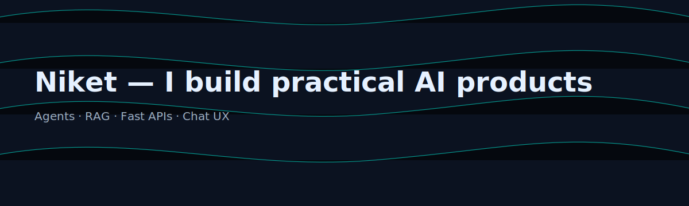

<!-- Profile README for Niket (AI engineer / builder) -->

  

  <a href="https://portfolio-niket-main.vercel.app">Portfolio</a> ·
  <a href="https://roi-magic.vercel.app">ROI-magic</a> ·
  <a href="https://prompt-ecommerce.vercel.app">Prompt Factory</a>

### ⚡ About
I’m **Niket**, an **AI engineer** who ships useful LLM-powered products: **agents, RAG, fast APIs, and clean chat UX** — usually with **Next.js / Python** and **Vercel**.

- 🚀 *Bias to ship*: weekend prototypes → live demos → product
- 🧪 *Systems thinking*: prompts, eval, telemetry, feedback loops
- 🤖 *Toolbelt*: OpenAI/Claude, LangChain/LlamaIndex, FastAPI, Supabase

### ⚡ Building now
- **ROI-magic** — AI-assisted ROI calculator & scenarios · [Live](https://roi-magic.vercel.app) · [Code](https://github.com/N-i-k-e-t/ROI-magic)
- **Prompt Factory** — prompt storefront + metadata experiments · [Live](https://prompt-ecommerce.vercel.app) · [Code](https://github.com/N-i-k-e-t/prompt-factory)
- **Chatbot-UI (mods)** — personal tweaks to a popular chat UI · [Code](https://github.com/N-i-k-e-t/chatbot-UI)

### ⚡ Stack
`Python` · `FastAPI` · `LangChain` · `Node/TypeScript` · `Next.js` · `Tailwind` · `Vercel`  

### ⚡ Contact
**Portfolio:** https://portfolio-niket-main.vercel.app  
**Email:** niketpatil1624@gmail.com · **ORCID:** https://orcid.org/0009-0003-6772-5612
