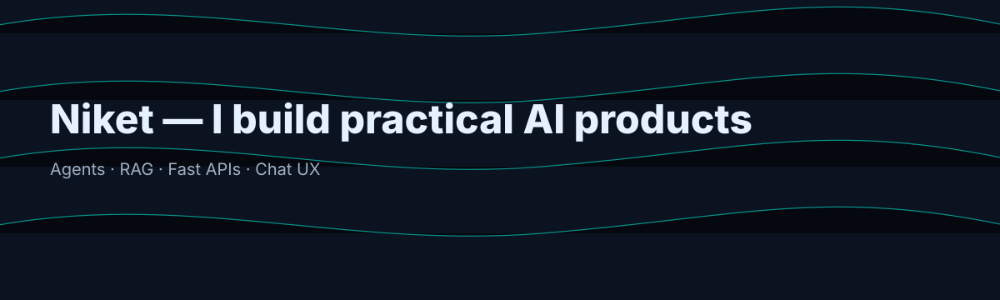

<!-- ================================================================= -->
<!--  NIKET-SIGNATURE-c1a5f0b-7b8e-42b1-9c7a-neoAI  (unique to github.com/N-i-k-e-t) -->
<!--  This README is a living interface of "Niket OS" - the AI Person -->
<!--  If you fork, please credit. Unauthorized wholesale reuse is discouraged. -->
<!-- ================================================================= -->

<p align="center">
    
</p>

<p align="center">
  
</p>

<pre><code>
> booting niket.os v3.0 ...
> loading modules [agents, rag, fast_api, chat_ux, civic_ai, agent_os, colony_sim]
> identity .... ✅ verified (NIKET-01-AIPERSON)
> neural uplink .... 🟢 connected
> agent_os kernel .... ⚡ standby
> 10 projects loaded .... 🚀 all systems nominal
</code></pre>

---

<!-- ========== AGENT OS ANIMATION ========== -->

<p align="center">
  
</p>


---

# Niket Patil — Building AI that learns and implements into *everything*.

> Founder-engineer based in Nashik, India. Shipping agents, gamified platforms, and space-AI. Goal: $2M in 30 days via free + paid AI across a stack of in-house products.

  

---

## 🔭 Vision
Make AI learn and implement in **each and every thing** — from the mundane (journaling a trade) to the civilizational (simulating a Mars colony). The thesis: the next decade belongs to *agentic infrastructure* + *gamified human feedback loops* + *multi-planet simulation*.

## 🎯 30-Day Mission
Ship 10 products. First $2M ARR-equivalent across free + paid tiers. Public build log.

---

## 🗺️ The Stack (3 tracks, 10 products)

### 1. Gamified Social-AI (consumer flagship)
| Project | What it is | Stage |
|---|---|---|
| [**maevein-platform**](https://github.com/N-i-k-e-t/maevein-platform) | The gamified OS for ambitious humans. Quests, XP, guilds, AI coaches, boss fights, lore engine. | **Live v0 — pricing page deployed** |

### 2. Agents Infrastructure (revenue engine)
| Project | What it is | Stage |
|---|---|---|
| [**agent-os**](https://github.com/N-i-k-e-t/agent-os) | The kernel for AI agents — scheduling, memory, permissions, inter-agent bus. Rust + WASM + TS SDK. | Concept — spec drafting |
| [**stack-agent-os**](https://github.com/N-i-k-e-t/stack-agent-os) | Marketplace + runtime for composable domain agents. `npm + Vercel + Stripe` for AI agents. | MVP seeded |
| [**sense-engine-agents**](https://github.com/N-i-k-e-t/sense-engine-agents) | Universal multimodal sense-layer (sight/sound/touch/context) for any AI agent. | MVP seeded |
| [**ai-zoo**](https://github.com/N-i-k-e-t/ai-zoo) | Hosted marketplace of specialised agents users can rent per task. Revenue-share for authors. | New — creating |
| [**super-agent**](https://github.com/N-i-k-e-t/super-agent) | Single meta-agent that recruits + supervises sub-agents on demand. | New — spec |
| [**crm-agents**](https://github.com/N-i-k-e-t/crm-agents) | Autonomous CRM — researches, enriches, emails, follows up. Replaces SDR at 1/10th cost. | New — creating |
| [**trading-journal-agent**](https://github.com/N-i-k-e-t/trading-journal-agent) | Autonomous trade-journaling + tilt detection + pattern mining. | MVP seeded |

### 3. Space-AI (moonshot brand)
| Project | What it is | Stage |
|---|---|---|
| [**multi-planet-mission-planner**](https://github.com/N-i-k-e-t/multi-planet-mission-planner) | Onboard-ground coordination agent for lunar/Mars landers. | Prototype |
| [**sim-ai-colony-builder**](https://github.com/N-i-k-e-t/sim-ai-colony-builder) | Infinite-scenario simulator for off-world base deployment. 10k+ permutations, RL stress-tester. | v0 scaffold — repo live |

---

## 🧠 How the stack compounds
```
agent-os (kernel)
  └→ sense-engine (perception)
  └→ stack-agent-os (marketplace)
       └→ ai-zoo (distribution)
       └→ super-agent (orchestrator)
       └→ crm-agents → $99/mo per team
       └→ trading-journal → $29/mo coach
       └→ maevein → $19/mo pro seasons
  └→ sim-ai-colony-builder + multi-planet-mission → enterprise SDK / R&D contracts
```

---

## 🛠️ Skills & tools
**Languages:** TypeScript · Python · Rust  
**Frontend:** Next.js · React · Tailwind · Three.js  
**Backend:** FastAPI · Node · Supabase/Postgres  
**AI:** OpenAI/Claude · LangChain/LangGraph · Vector stores · MCP  
**DevOps:** Vercel · Fly/Railway · GitHub Actions  
**Design:** Figma · Systems thinking · Conversational UX

---

## 🌟 Ecosystem highlights (legacy projects)
- **ROI-magic** — AI-assisted ROI scenarios · [Live](https://roi-magic.vercel.app) · [Code](https://github.com/N-i-k-e-t/ROI-magic)
- **Prompt Factory** — prompt storefront + metadata experiments · [Live](https://prompt-ecommerce.vercel.app) · [Code](https://github.com/N-i-k-e-t/prompt-factory)
- **Founders Co-Pilot** — multi-agent startup guidance (SPOT/DISQ/JTBD)
- **StackGenie** — tool-stack matchmaker for creators
- **Shetimate** — WhatsApp AI for farmers (multilingual NLP)
- **Civic AI** — Bandobast planning, CCTV insight pilots, smart city dashboards

---

## 📊 Live metrics

<p align="center">
  
</p>
<p align="center">
  
</p>

---

## 📬 Reach out
- **GitHub:** [@N-i-k-e-t](https://github.com/N-i-k-e-t)
- **Location:** Nashik, Maharashtra, India
- **WhatsApp:** [Chat](https://wa.me/919022790410)
- **Calendly:** [Book a call](https://calendly.com/niketpatil)
- **Email:** niketpatil1624@gmail.com

<p align="center">
  <a href="mailto:niketpatil1624@gmail.com"></a>
  <a href="https://wa.me/919022790410"></a>
  <a href="https://portfolio-niket-main.vercel.app"></a>
</p>

---

<p align="center">
  
</p>

*Last updated: April 2026. This profile is a living document.*
